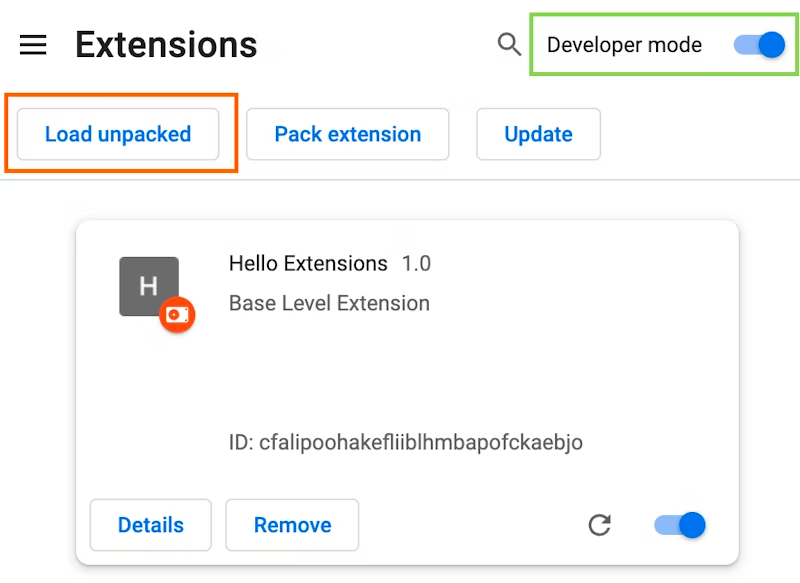

# jira-banner-be-gone
A chrome browser extension to remove banner announcements from Jira.  The text of any removed announcement is logged in the browser console just in case you still want it somewhere.

## Installation
1. Download or clone this github respository to you local machine.
2. Go to the Extensions page by entering `chrome://extensions` in a new tab.
3. Enable Developer Mode by clicking the toggle switch next to `Developer mode`.
4. Click the `Load unpacked` button and select the extension directory.

